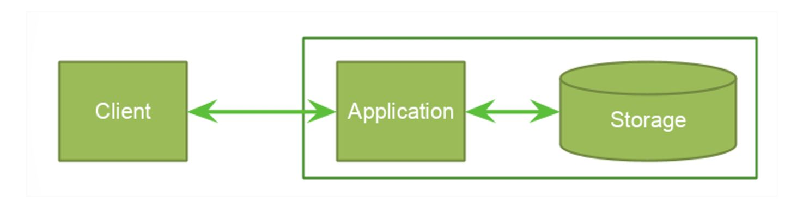

# Design

## Stack de technique

- Backend : NodeJs
- Frontend : JavaScript, HTML, CSS (Bootstrap)

## Modèle d'Architecture

Architecture : 3 tiers (Client-Application-Stockage)

## Modèle de données

	Une table **Vols**, avec en entrée:
	- ID vol 
	- Prix
	- CodeDepart
	- CodeArrivée
	- Nb places disponibles

	Ensuite nous avons une **Aéroport**:
	- Nom
	- Code
  
  	Une table **Tickets**, avec en entrée:
	- ID vol 
	- ID Client

	Et enfin une table **Client**:
	- ID Client
	- Nom
	- Prénom
	- Adresse mail
	- Password
  
Le format d'un ticket est: CDG-JDK-400.
Nous stockons nos données en mémoire.